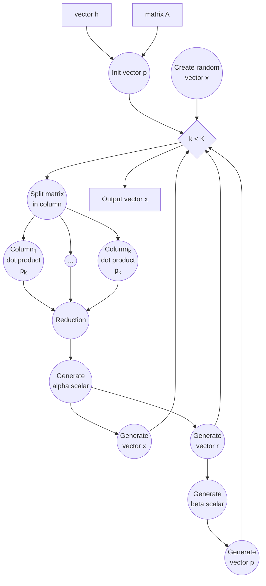

# Conjugate gradient workflow with StreamFlow

This repository contains a [Common Workflow Language](https://www.commonwl.org/) (CWL) implementation of a Conjugate Gradient workflow. 

This activity was done in collaboration with ENI company for the Innovation Grant `Cross-Platform Full Waveform Inversion`.

# Software requirements

numpy>=2.0.0   
python>=3.8   
streamflow>=0.2.0.dev11   

## Usage 

It is possible to execute this implementation of Conjugate Gradient workflow with any CWL runner. We propose below the execution using [StreamFlow](https://streamflow.di.unito.it/) WMS.

```bash
CG_DIR=$(pwd)
python -m venv venv
source venv/bin/activate
git clone --branch fix/optinal-param --depth 1 https://github.com/alpha-unito/streamflow.git
cd streamflow
pip install -r requirements.txt .
cd ${CG_DIR}/cwl/scripts
pip install -r requirements.txt
cd ${CG_DIR}
streamflow run streamflow.yml
```

This repository supplies a default StreamFlow file. It is configured to a local execution of the workflow, however, it is possible to customize it for distributed executions ([how to configure it](https://streamflow.di.unito.it/documentation/latest/operations.html)).   
It is proposed StreamFlow to execute it because it allows hybrid workflow executions involving different locations.

# Repository structure

The workflow is described with the CWLv1.2 with the cwltool:Loop extension
- `cwl/config.yml` contains the input value of the workflow.
- `cwl/data` contains some small input matrix examples.
- `cwl/main.cwl` contains the entrypoint of the workflow.
- `cwl/scripts` contains some Python scripts which are executed by the workflow steps. The main script is `cj_toolkit.py`
- `streamflow.yml` contains a default configuration to run the workflow locally with StreamFlow.
- `templates` contains some file which are helpful for the configuration of distributed execution across multi-HPC systems.

# Workflow 

Let A matrix and h vector,   
where, A = A<sup>T</sup> and A &#8712; &reals;<sup>K,K</sup>



# Contributors

Alberto Mulone <alberto.mulone@unito.it>   
Iacopo Colonnelli <iacopo.colonnelli@unito.it>   
Bienati Nicola <Nicola.Bienati@eni.com>   
Bortot Luca <Luca.Bortot@eni.com>   
Marco Aldinucci <marco.aldinucci@unito.it>